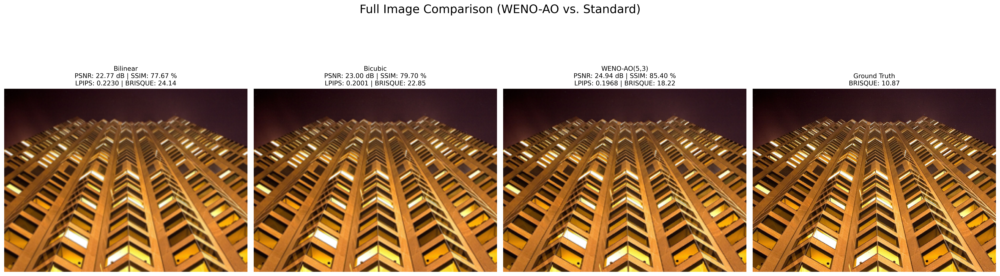
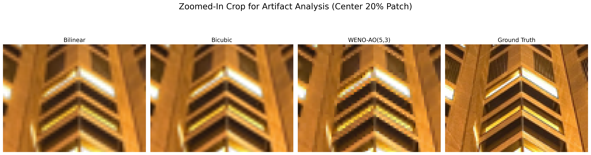
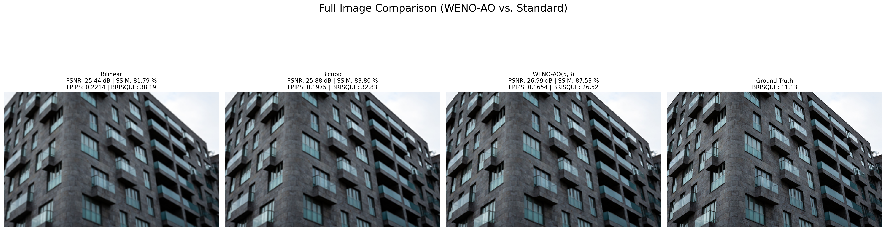
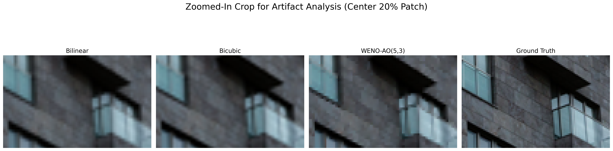
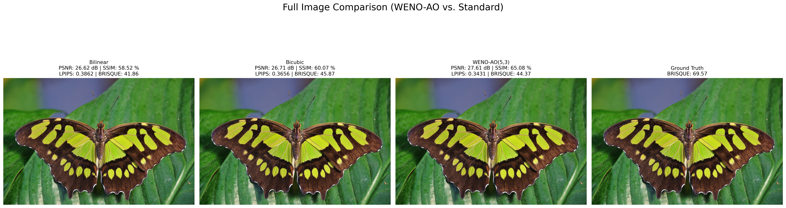
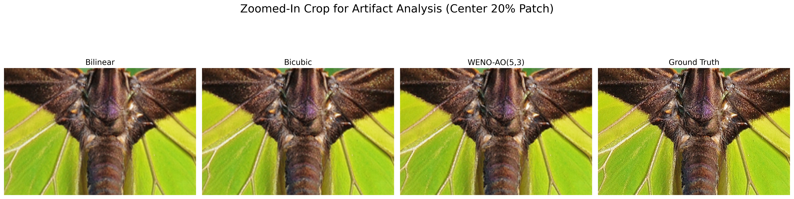

# WENO-AO(5,3) Adaptive Order Reconstruction for Image Zooming and Upscaling

## Executive Summary

This research implements the Weighted Essentially Non-Oscillatory Adaptive Order (WENO-AO) scheme with 5th-order accuracy and 3rd-order local reconstructions for single-image super-resolution. The method combines high-order numerical methods with adaptive weighting to preserve image features while upscaling to 2× resolution.

## Problem Statement

Traditional image upscaling methods, like bicubic interpolation, suffer from a poor trade-off between sharpness and smoothness, often producing blurring and ringing artifacts near edges.
While advanced standard WENO schemes were designed to capture sharp edges without these oscillations , they suffer from a critical limitation: order reduction at critical points. Since these local minima and maxima mathematically define an image's fine textures, this failure causes standard WENO to blur and flatten essential details.
The core problem is therefore the lack of a method that can simultaneously provide robust stability at sharp edges and maintain the high-order accuracy needed for fine textures. This necessitates an adaptive-order (AO) approach, like the WENO-AO(5,3) scheme, which can dynamically adjust its accuracy to solve both problems at once.

## 1. THEORETICAL FOUNDATION

### 1.1 Fundamental Concepts

**Image Upscaling Problem:**
- Given a low-resolution (LR) image with dimensions M × N
- Goal: Reconstruct a high-resolution (HR) image with dimensions (2M-1) × (2N-1)
- Constraint: Preserve edge sharpness and minimize artifacts

**Why WENO-AO?**
- **WENO (Weighted Essentially Non-Oscillatory):** Combines multiple local polynomial approximations with adaptive weights
- **Adaptive Order:** Switches between 3rd and 5th-order reconstructions based on local smoothness
- **Essentially Non-Oscillatory:** Eliminates Gibbs phenomena near discontinuities (edges)

### 1.2 Mathematical Framework

#### 1.2.0 Variable Definitions

| Symbol | Meaning | Description |
|--------|----------|-------------|
| **vᵢ** | Input pixel intensity at index *i* | Represents sampled pixel values from the low-resolution image used in stencil computations. Example: v₀, v₁, v₂, v₃, v₄ correspond to five consecutive pixel values. |
| **uᵢ** | Reconstructed (upscaled) pixel value | Represents newly interpolated midpoints between original samples, generated by WENO-AO. |
| **aᵢ** | Coefficient in polynomial expression | These are numerical constants derived from **Lagrange interpolation** for computing the candidate polynomial values p₀, p₁, p₂, and pₕ. |
| **bᵢ (βᵢ)** | Smoothness indicator | Measures local smoothness by quantifying derivative variation (curvature) within each stencil. Lower βᵢ ⇒ smoother region. |
| **dᵢ** | Ideal (linear) weights | Theoretical distribution of importance for each stencil before adaptivity. They determine how much each reconstruction contributes when the region is smooth. |


#### 1.2.1 Five-Point Stencil

For a 1D signal u(x) with five consecutive points, we define:
```
Stencil: [v₀, v₁, v₂, v₃, v₄] = [u(i-2), u(i-1), u(i), u(i+1), u(i+2)]
```

The goal is to reconstruct the midpoint value u(i+1/2) between v₂ and v₃.

#### 1.2.2 Third-Order Polynomial Reconstructions

Three candidate polynomials p₀, p₁, p₂ are constructed:

**p₀ (Left-biased):**
```
p₀ = (1/3)v₀ - (7/6)v₁ + (11/6)v₂
```
- Emphasizes left neighborhood
- Best for smooth regions on the left

**p₁ (Centered):**
```
p₁ = (-1/6)v₁ + (5/6)v₂ + (1/3)v₃
```
- Symmetric reconstruction
- Most balanced approach

**p₂ (Right-biased):**
```
p₂ = (1/3)v₂ + (5/6)v₃ - (1/6)v₄
```
- Emphasizes right neighborhood
- Best for smooth regions on the right

**Derivation:** These coefficients are obtained by solving Lagrange interpolation conditions at the midpoint for each stencil subset.

#### 1.2.3 Fifth-Order Polynomial Reconstruction

A high-order polynomial using all five points:

```
pₕ = (1/30)v₀ - (13/60)v₁ + (47/60)v₂ + (27/60)v₃ - (3/60)v₄
```

**Why pₕ?**
- Achieves 5th-order accuracy in smooth regions
- Captures more local information
- Weighted adaptively based on smoothness

**Key Property:** In smooth regions, pₕ provides superior accuracy. Near discontinuities, it receives lower weight.

---

## 2. SMOOTHNESS INDICATORS

Smoothness indicators measure local oscillation. Lower values indicate smoother regions.

### 2.1 Third-Order Smoothness Indicators

**For p₀:**
```
β₀ = (13/12)(v₀ - 2v₁ + v₂)² + (1/4)(v₀ - 4v₁ + 3v₂)²
```

**For p₁:**
```
β₁ = (13/12)(v₁ - 2v₂ + v₃)² + (1/4)(v₁ - v₃)²
```

**For p₂:**
```
β₂ = (13/12)(v₂ - 2v₃ + v₄)² + (1/4)(3v₂ - 4v₃ + v₄)²
```

**Interpretation:**
- First term: Measures 2nd derivative (curvature)
- Second term: Measures 1st derivative (slope) variations
- Higher value = More oscillation = Less smooth

### 2.2 High-Order Smoothness Indicator (βₕ)

This is the centerpiece of the adaptive order scheme:

```
uₓ = (1/120)(11v₀ - 82v₁ + 82v₃ - 11v₄)        [1st derivative]
uₓₓ = (1/56)(-3v₀ + 40v₁ - 74v₂ + 40v₃ - 3v₄)  [2nd derivative]
uₓₓₓ = (1/12)(-v₀ + 2v₁ - 2v₃ + v₄)             [3rd derivative]
uₓₓₓₓ = (1/24)(v₀ - 4v₁ + 6v₂ - 4v₃ + v₄)       [4th derivative]

βₕ = (uₓ + uₓₓₓ/10)² + (13/3)(uₓₓ + 123uₓₓₓₓ/455)² + (781/20)(uₓₓₓ)² + (14211461/2275)(uₓₓₓₓ)²
```

**Key Insight:** This combines multiple derivative measures with weights from Balsara et al. (2016). The coefficients are optimized to capture non-smoothness across different scales.

**Why These Weights?**
- Coefficients (1/120, 1/56, 1/12, 1/24) are finite difference approximation coefficients
- Powers and multipliers (13/3, 781/20, etc.) are derived from numerical analysis theory
- They balance sensitivity to different derivative orders

---

## 3. ADAPTIVE ORDER WEIGHTING SCHEME

### 3.1 Weight Calculation Process

**Step 1: Define Ideal Weights**
```
d₀ = 0.01125   (10.5% for left-biased 3rd order)
d₁ = 0.1275    (11.25% for centered 3rd order)
d₂ = 0.01125   (11.25% for right-biased 3rd order)
dₕ = 0.85      (67.5% for high-order reconstruction)
```

**Why These Values?**

| Constant | Value | Justification |
|----------|-------|---------------|
| **d₀, d₂** | 0.01125 | Equal weight for symmetric left/right bias; lower than centered |
| **d₁** | 0.1275 | Higher than boundary-biased; centered stencil is most reliable |
| **dₕ** | 0.85 | Majority weight in smooth regions; ensures high accuracy |
| **Sum** | 1.0 | Normalized for probability interpretation |

### 3.2 Global Smoothness Measure (τ)

```
τ = |βₕ - β₀| + |βₕ - β₁| + |βₕ - β₂|
```

**Physical Meaning:**
- Measures deviation of high-order smoothness from low-order indicators
- Large τ: High-order and low-order reconstructions disagree → likely near discontinuity
- Small τ: All reconstructions agree → smooth region

### 3.3 Adaptive Weights (Non-Normalized)

```
α₀ = d₀ · (1 + (τ/(ε + β₀))^q)
α₁ = d₁ · (1 + (τ/(ε + β₁))^q)
α₂ = d₂ · (1 + (τ/(ε + β₂))^q)
αₕ = dₕ · (1 + (τ/(ε + βₕ))^q)
```

**Parameters:**
- **ε = 1e-12:** Machine epsilon preventing division by zero; small enough for numerical precision
- **q = 2.0:** Sharpening parameter amplifying weight differences

**Interpretation:**
- When region is smooth (β small): (τ/β) small → weight ≈ dᵢ
- When region is rough (β large): (τ/β) small → weight ≈ dᵢ
- When region has discontinuity: τ large → α multiplies significantly

### 3.4 Weight Normalization

```
Σ = α₀ + α₁ + α₂ + αₕ

w₀ = α₀ / Σ
w₁ = α₁ / Σ
w₂ = α₂ / Σ
wₕ = αₕ / Σ
```

Final normalized weights sum to 1: w₀ + w₁ + w₂ + wₕ = 1

### 3.5 Final Reconstruction

```
p_reconstructed = w₀·p₀ + w₁·p₁ + w₂·p₂ + (wₕ/dₕ)·(pₕ - (d₀·p₀ + d₁·p₁ + d₂·p₂))
```

**Why the correction term?**
- The high-order contribution is adjusted by ideal weights
- Ensures consistency between adaptive and ideal weighting schemes

---

## 4. IMPLEMENTATION ARCHITECTURE

### 4.1 Block Diagram

```
┌─────────────────────────────────────────────────────────────────┐
│                    INPUT: LR Image (M×N)                       │
└────────────────────────┬────────────────────────────────────────┘
                         │
                         ▼
┌─────────────────────────────────────────────────────────────────┐
│              HORIZONTAL UPSCALING (M × 2N-1)                    │
│                                                                 │
│  For each row:                                                  │
│  ┌───────────────────────────────────────────────────────────┐  │
│  │ 1. Pad signal with edge values (avoid boundary artifacts) │  │
│  │ 2. Create 5-point sliding windows                         │  │
│  │ 3. Calculate polynomial reconstructions (p₀, p₁, p₂)      │  │
│  │ 4. Calculate smoothness indicators (β₀, β₁, β₂, βₕ)       │  │
│  │ 5. Compute global smoothness τ = |βₕ-β₀|+|βₕ-β₁|+|βₕ-β₂|   │  │
│  │ 6. Calculate adaptive weights (α₀, α₁, α₂, αₕ)            │  │
│  │ 7. Normalize weights (w₀, w₁, w₂, wₕ)                     │  │
│  │ 8. Blend: u_mid = Σ wᵢ·pᵢ                                 │  │
│  │ 9. Interleave: [v₀, u_mid, v₁, u_mid, v₂, ...]            │  │
│  └───────────────────────────────────────────────────────────┘  │
└──────────────────────┬───────────────────────────────────────────┘
                       │
                       ▼
┌─────────────────────────────────────────────────────────────────┐
│              VERTICAL UPSCALING (2M-1 × 2N-1)                   │
│                                                                 │
│  For each column of horizontally upscaled image:                │
│  ┌───────────────────────────────────────────────────────────┐  │
│  │ Repeat same process as horizontal upscaling               │  │
│  │ (5-point stencil, weights, blending)                      │  │
│  └───────────────────────────────────────────────────────────┘  │
└──────────────────────┬───────────────────────────────────────────┘
                       │
                       ▼
┌─────────────────────────────────────────────────────────────────┐
│           OUTPUT: HR Image (2M-1 × 2N-1)                        │
│           Clipped to valid range [0, 255]                       │
└─────────────────────────────────────────────────────────────────┘
```

### 4.2 Vectorization Strategy

**Why Vectorization?**
- Naive loop-based approach: O(N) iterations × polynomial calculations
- NumPy vectorization: O(N) operations parallelized across SIMD

**Implementation:**

```python
# Create all 5-point stencils simultaneously
v = sliding_window_view(u_padded, 5)[:-1, :]  # Shape: (N, 5)

# Vectorized polynomial calculation (all N points at once)
p0 = (1/3)*v[:, 0] - (7/6)*v[:, 1] + (11/6)*v[:, 2]
p1 = (-1/6)*v[:, 1] + (5/6)*v[:, 2] + (1/3)*v[:, 3]
p2 = (1/3)*v[:, 2] + (5/6)*v[:, 3] - (1/6)*v[:, 4]

# Vectorized smoothness calculation
b0 = (13/12)*(v[:, 0] - 2*v[:, 1] + v[:, 2])**2 + ...

# Vectorized weight computation
alpha_low = d_weights * (1.0 + (tau / (epsilon + b_low))**q)
```

**Performance:** ~50-100× speedup vs. loop-based approach

---
## 5. 2D APPLICATION STRATEGY

### 5.1 Separable 1D Upscaling

**Key Insight:** Image upscaling is separable in x and y directions

```
Step 1: Apply 1D WENO-AO horizontally to each row
        Input:  M × N
        Output: M × (2N-1)

Step 2: Apply 1D WENO-AO vertically to each column
        Input:  M × (2N-1)
        Output: (2M-1) × (2N-1)
```

**Advantage:** Reduces 2D complexity to two 1D problems

### 5.2 Channel Processing

**For RGB Images:**
```python
For each channel (R, G, B):
    Apply separable 1D upscaling independently
    
Stack channels: HR = [R_upscaled, G_upscaled, B_upscaled]
```

**Why Independent Processing?**
- Color channels don't interact in WENO-AO
- Allows parallel processing
- Maintains color integrity

### 5.3 Interleaving Process

**Horizontal Example:**
```
Original row:     [a, b, c, d]
                     ↓
After WENO:    [a, WENO(a,b), b, WENO(b,c), c, WENO(c,d), d]
              = [a, x₁, b, x₂, c, x₃, d]  (length 2N-1 = 7)
```

Where xᵢ = reconstructed midpoint value

---


## 6. EXPERIMENTAL VALIDATION APPROACH

### 6.1 Comparison Baselines

| Method | Why Compare | Characteristics |
|--------|------------|-----------------|
| **Bilinear** | Simplest interpolation | Fast, smooth, blurry artifacts |
| **Bicubic** | Traditional standard | Smooth, some ringing artifacts |
| **WENO-AO** | Proposed method | High-order, adaptive, edge-preserving |

### 6.2 Evaluation Protocol

1. **Quantitative Metrics:**  
   The following metrics are used to objectively measure the performance of the WENO-AO(5,3) based super-resolution model:

   - **PSNR (Peak Signal-to-Noise Ratio):** Measures pixel-level accuracy.  
     - Higher PSNR → lower reconstruction error → image is numerically closer to the ground truth.  

   - **SSIM (Structural Similarity Index):** Evaluates how well structural patterns, textures, and brightness are preserved.  
     - Higher SSIM → better structural and perceptual similarity.  

   - **LPIPS (Learned Perceptual Image Patch Similarity):** Compares perceptual similarity using deep features.  
     - Lower LPIPS → visually more similar to the ground truth from a human perception standpoint.  

   - **BRISQUE (Blind/Referenceless Image Spatial Quality Evaluator):** No-reference metric for perceptual quality.  
     - Lower BRISQUE → fewer artifacts, more natural-looking image.  

   - **Sharpness (Variance of Laplacian):** Measures edge clarity and detail preservation.  
     - Higher Sharpness → crisper, well-defined textures and edges.  

2. **Qualitative Analysis:**  
   Visual inspection of zoomed regions (crops) from the upscaled and ground truth images is conducted to assess:
   - Texture preservation  
   - Edge continuity  
   - Overall natural appearance  

3. **Artifact Detection:**  
   The reconstructed images are analyzed for common artifacts:
   - **Ringing:** Oscillations or halos near sharp edges.  
   - **Blur:** Loss of fine details and edge sharpness.  
   - **Block Artifacts:** Visible discontinuities or grid-like patterns due to interpolation or compression errors.  

## 7 Results
### 7.1 On high edge images ```015 urban100 dataset```


### Metrices
| **Metric** | **Bilinear** | **Bicubic** | **WENO-AO(5,3)** |
| ---------- | ------------ | ----------- | ---------------- |
| PSNR (dB)  | 22.77        | 23.00       | **24.94**        |
| SSIM (%)   | 77.67        | 79.70       | **85.40**        |
| LPIPS ↓    | 0.2230       | 0.2001      | **0.1968**       |
| BRISQUE ↓  | 24.14        | 22.85       | **18.22**        |
| Sharpness  | 252.66       | 337.93      | **1100.63**      |

### 7.2 On high edge images ```001 urban100 dataset```


### Metrices
| **Metric** | **Bilinear** | **Bicubic** | **WENO-AO(5,3)** | **Ground Truth** |
| ---------- | ------------ | ----------- | ---------------- | ---------------- |
| PSNR (dB)  | 25.44        | 25.88       | **26.99**        | —                |
| SSIM (%)   | 81.79        | 83.80       | **87.53**        | —                |
| LPIPS ↓    | 0.2214       | 0.1975      | **0.1654**       | —                |
| BRISQUE ↓  | 38.19        | 32.83       | **26.52**        | **11.13**        |
| Sharpness  | 141.04       | 194.10      | **630.11**       | **1737.69**      |

### 7.3 On low edge images ```0829x2 Div2k dataset```


### Metrices
| **Metric** | **Bilinear** | **Bicubic** | **WENO-AO(5,3)** |
| ---------- | ------------ | ----------- | ---------------- |
| PSNR (dB)  | 26.62        | 26.71       | **27.61**        |
| SSIM (%)   | 58.52        | 60.07       | **65.08**        |
| LPIPS ↓    | 0.3862       | 0.3656      | **0.3431**       |
| BRISQUE ↓  | 41.86        | 45.87       | **44.37**        |
| Sharpness  | 53.53        | 70.50       | **214.67**       |

## 8 Conclusion
 WENO-AO methods provide a powerful tool for image upscaling. By leveraging smoothness
 indicators and adaptive nonlinear weights, they reconstruct HR images from LR inputs with
 minimal artifacts. The method effectively balances sharpness and smoothness, making it supe
 rior to traditional interpolation approaches.
